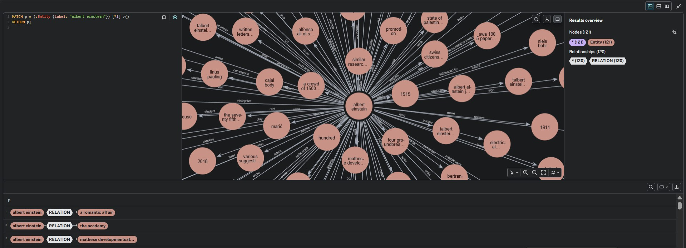
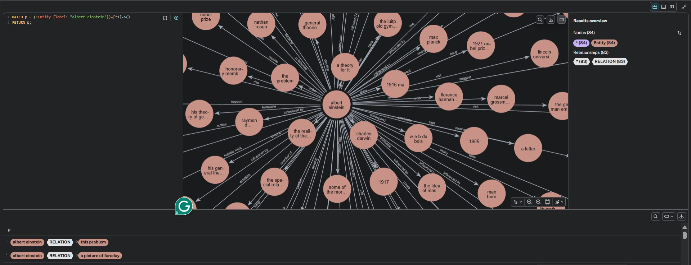
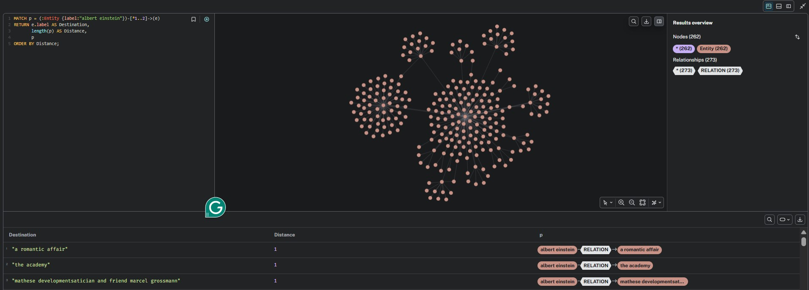
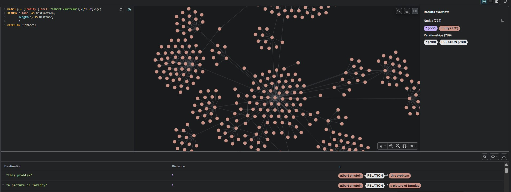
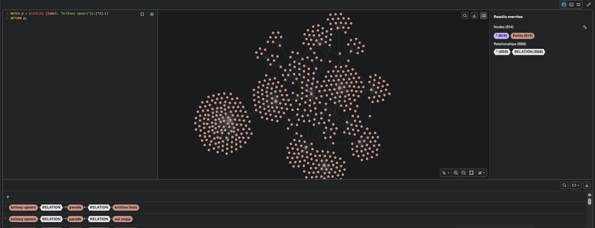
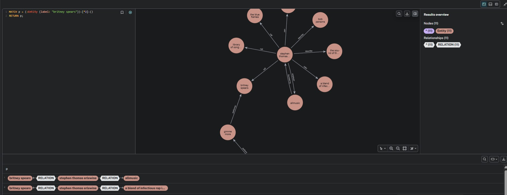

# Jeopardy Question Generation — RAG vs. Graph RAG

Reproduction and extension of *Retrieval-Augmented Generation for Knowledge-Intensive NLP Tasks* (Lewis et al., 2021) on the **Jeopardy** task (SearchQA). This project implements standard RAG baselines and a custom **Graph RAG** pipeline built from Wikipedia, comparing their performance on answer-conditioned Jeopardy-style question generation.

## Overview

The repository contains two parallel tracks for the Jeopardy problem:

1. **Regular RAG** — Fine-tuning Facebook's pre-trained `RAG-Sequence` and `RAG-Token` models on the SearchQA dataset, using the dense Wikipedia DPR index for retrieval.
2. **Graph RAG** — Constructing a large semantic knowledge graph from Wikipedia passages (with and without coreference resolution) and using subgraph retrieval to augment a BART-large generator.

The whole idea is to reproduce regular RAG and compare it against a **knowledge-base-powered Graph RAG** with two graph variants:
- **With coreference resolution**: ~60k nodes / ~55k edges
- **Without coreference resolution**: ~245k nodes / ~227k edges

## Repository Structure

```
jeopardy/
├── Answerability-Metric/       # Q-BLEU evaluation (Nema & Khapra, EMNLP 2018)
│   ├── answerability_score.py
│   ├── bleu/
│   ├── rouge/
│   └── tokenizer/
│
├── knowledge graph/            # Graph RAG pipeline
│   ├── kg_builder.ipynb        # Semantic KG builder (REBEL + spaCy + fastcoref)
│   ├── bart_eval_coref.ipynb   # BART eval with coref-resolved graph (~60k nodes)
│   ├── bart_eval_no_coref.ipynb# BART eval with raw graph (~245k nodes)
│   ├── semantic_graph_merged.graphml
│   └── semantic_graph_merged.json
│
├── rag sequence/               # Standard RAG-Sequence fine-tuning
│   ├── rag_seq.ipynb
│   └── rag_sequence_final/     # Saved checkpoint + tokenizers
│
└── rag token/                  # Standard RAG-Token fine-tuning
    ├── rag_token.ipynb
    └── rag_token_final/        # Saved checkpoint + tokenizers
```

## Setup

### Core Dependencies

- PyTorch ≥ 2.2 (CUDA recommended)
- `transformers==4.30.0`
- `datasets==2.14.6`
- `faiss-cpu==1.7.4`
- `spacy` + `en_core_web_sm`
- `fastcoref`
- `networkx`
- `sacrebleu`, `evaluate`, `scikit-learn`, `tqdm`, `pandas`, `numpy==1.26.4`

## Datasets

| Task | Dataset | Split sizes |
|------|---------|-------------|
| Jeopardy (RAG) | `search_qa` (train_test_val) | 80k train / 21.6k val / 43.2k test |
| Knowledge Graph | `facebook/wiki_dpr` (Wikipedia passages) | 21M passages, 768-dim DPR vectors (only 1 parquet file)|

## 1. Regular RAG (Jeopardy)

### RAG-Sequence
- **Checkpoint**: `facebook/rag-sequence-nq`
- **Training**: 2 epochs, batch size 2 (gradient accumulation 8), LR 1e-5, FP16
- **Input**: answer entity → target Jeopardy question
- **Results (val, 10k samples)**:
  - BLEU-1: **10.00**
  - Q-BLEU-1: **18.10**

### RAG-Token
- **Checkpoint**: `facebook/rag-token-nq`
- **Training**: same hyper-parameters as RAG-Sequence
- **Results (val, 10k samples)**:
  - BLEU-1: **14.20**
  - Q-BLEU-1: **19.10**

Both models freeze the DPR question encoder and fine-tune only the BART generator.

## 2. Graph RAG (Jeopardy)

### Knowledge-Graph Construction (`kg_builder.ipynb`)

The graph is built from Wikipedia passages using a **three-phase pipeline**:

1. **Coreference Resolution** (`fastcoref` / `FCoref`) — replaces pronouns with representative mentions across passages.
2. **Relation Extraction** — dual extraction:
   - **REBEL** (`Babelscape/rebel-large`): seq2seq relation extraction with beam-score confidence.
   - **Dependency Parsing** (`spaCy`): rule-based SVO extraction with NER grounding.
3. **Graph Fusion** — deduplicates edges, fuses confidence scores, and merges sources.

#### Graph Statistics

| Variant | Nodes | Edges |
|---------|-------|-------|
| With coreference (`semantic_graph_merged.graphml`) | ~60,679 | ~55,127 |
| Without coreference (`final_graph.graphml`) | ~245,576 | ~227,880 |

### BART-Large Evaluation (`bart_eval_coref.ipynb` / `bart_eval_no_coref.ipynb`)

Two evaluation conditions are compared side-by-side:

1. **Baseline** — BART-large receives only the answer entity.
2. **GraphRAG** — BART-large receives the answer entity + top-20 confident triples from a 2-hop subgraph.

#### Fine-Tuned BART + GraphRAG Results
- BLEU-1: **15.30**
- Q-BLEU-1: **20.20**

> Zero-shot BART-large without fine-tuning largely hallucinates or repeats the prompt; fine-tuning on SearchQA is required for usable generation.

## 3. Knowledge Graph Visual Comparison (with vs. without Coref)

The following side-by-side screenshots show the same queries executed on the **with-coreference** graph (left) and the **without-coreference** graph (right). Coreference resolution collapses pronouns and aliases into canonical entities, producing denser, more semantically coherent neighborhoods.

### Albert Einstein — 1-hop neighborhood

| With Coref (~121 nodes, 120 rels) | Without Coref (~84 nodes, 83 rels) |
|:---:|:---:|
|  |  |

### Albert Einstein — 2-hop neighborhood

| With Coref (~262 nodes, 273 rels) | Without Coref (~772 nodes, 789 rels) |
|:---:|:---:|
|  |  |

### Britney Spears — 2-hop neighborhood

| With Coref (~614 nodes, 668 rels) | Without Coref (~11 nodes, 11 rels) |
|:---:|:---:|
|  |  |

> **Observation:** Without coreference, entities like "Britney Spears" remain almost disconnected (only 11 nodes within 2 hops) because pronouns and partial mentions are not resolved back to the canonical node. With coreference, the same query surfaces a rich, densely connected subgraph (614 nodes) that captures far more relational context.

## Evaluation Metrics

- **BLEU-1** (sacrebleu): n-gram overlap between generated and reference questions.
- **Q-BLEU-1** (Answerability-Metric): weighted combination of BLEU, NER overlap, question-type overlap, and relevance — designed specifically for question-generation quality (Nema & Khapra, EMNLP 2018).

## Key Files

| File | Purpose |
|------|---------|
| `rag token/rag_token.ipynb` | Fine-tune RAG-Token on SearchQA |
| `rag sequence/rag_seq.ipynb` | Fine-tune RAG-Sequence on SearchQA |
| `knowledge graph/kg_builder.ipynb` | Build semantic KG from Wikipedia |
| `knowledge graph/bart_eval_coref.ipynb` | Evaluate BART with coref KG (~60k) |
| `knowledge graph/bart_eval_no_coref.ipynb` | Evaluate BART with raw KG (~245k) |

## Citation

```bibtex
@article{lewis2021retrieval,
  title={Retrieval-augmented generation for knowledge-intensive NLP tasks},
  author={Lewis, Patrick and Perez, Ethan and Piktus, Aleksandra and Petroni, Fabio and Karpukhin, Vladimir and Goyal, Naman and K{\"u}ttler, Heinrich and Lewis, Mike and Yih, Wen-tau and Rockt{\"a}schel, Tim and others},
  journal={Advances in Neural Information Processing Systems},
  year={2021}
}
```

## License

This project is for academic reproducibility research. Model checkpoints and datasets follow their respective original licenses (Facebook RAG, HuggingFace, Wikipedia DPR).
